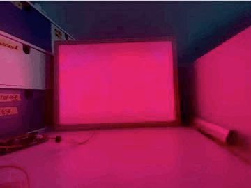
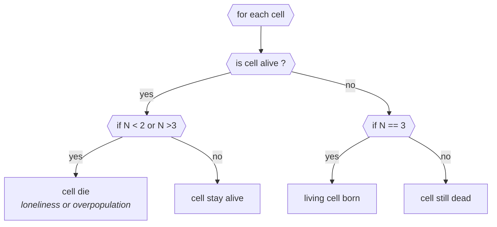

# RP2040-game-of-light

**:warning: :construction: W.I.P**

Trully lively lighting atmosphere. Bonus: godmode



- [RP2040-game-of-light](#rp2040-game-of-light)
  - [1.2. Hardware](#12-hardware)
    - [1.2.1. BOM (bill of material)](#121-bom-bill-of-material)
    - [1.2.2. Schematics](#122-schematics)
  - [1.3. Software](#13-software)
    - [1.3.1. Requirements](#131-requirements)
    - [1.3.2. GOL rules](#132-gol-rules)
    - [1.3.3. Notes for future me](#133-notes-for-future-me)

## 1.2. Hardware

### 1.2.1. BOM (bill of material)

- MCU : [Raspbery pi pico](https://www.raspberrypi.com/documentation/microcontrollers/raspberry-pi-pico.html)
- Debug probe [(another raspbery pi pico)](https://github.com/rp-rs/rp2040-project-template/blob/main/debug_probes.md#raspberry-pi-pico)
- LEDSTRIP: [Adafruit neopixel ledstrip (144 LEDs)](https://www.adafruit.com/product/1138)
- LLV: logic level converter 3.3 <-> 5V (no name)
- 100 ùF capacitor
- Basic electronic stuff (breadboard, cable, connectors ...)

### 1.2.2. Schematics

```ascii


                           ┌──RP2040───┐
                      ┌────┤VSYS       │
                      │    │           │
                      │  ┌─┤GND     IO?│
                      │  │ └─────────┬─┘
                      │  │           │
  ┌─────┐   ┌────┐    │  │ ┌─────────┴─┐
  │     ├─>─┤ C1 ├──┬─┴──┼─┤   NONAME  │
  │ +5V │   │100 │  │    │ │ TTL LLV   │
  │jack ├─>─┤ùF  ├──┼───┬┴─┤ 3.3 -> 5V │
  └─────┘   └────┘  │   │  └─────────┬─┘
                    │   │            │
                    │   │   ┌────────┘
                    │   │   │
                  ┌─┴─┬─┴─┬─┴─┐
                  │+5V│GND│Din│
        ┌─┬───────┼───┼───┼───┼───────┐
        │ │┼┼┼┼┼┼┼┼┼┼┼┼┼┼┼┼┼┼┼┼┼┼┼┼┼┤▼│
        │▼├┼┼┼┼┼┼┼┼┼┼┼┼┼┼┼┼┼┼┼┼┼┼┼┼┼│ │
        │ │┼┼┼┼┼┼┼┼┼┼┼┼┼┼┼┼┼┼┼┼┼┼┼┼┼┤▼│
        │▼├┼┼┼┼┼┼┼───┼─────┼┼┼┼┼┼┼┼┼│ │
        │ │┼┼┼┼┼┼│LED│STRIP│┼┼┼┼┼┼┼┼┤▼│
        │▼├┼┼┼┼┼┼┼───┼─────┼┼┼┼┼┼┼┼┼│ │
        │ │┼┼┼┼┼┼┼┼────┼┼┼┼┼┼┼┼┼┼┼┼┼┤▼│
        │▼├┼┼┼┼┼┼┼│8*17│┼┼┼┼┼┼┼┼┼┼┼┼│ │
        │ │┼┼┼┼┼┼┼┼────┼┼┼┼┼┼┼┼┼┼┼┼┼│ │
        └─┴─────────────────────────┴─┘


```

## 1.3. Software

### 1.3.1. Requirements

source : [rp-rs github project requirements](https://github.com/rp-rs/rp2040-project-template#requirements)

- The standard Rust tooling (cargo, rustup) : eg. `curl --proto '=https' --tlsv1.2 -sSf https://sh.rustup.rs | sh`
- Toolchain support for the cortex-m0+ processors in the rp2040 (thumbv6m-none-eabi) : eg. `rustup target add thumbv6m-none-eabi`
- [flip-link](https://github.com/knurling-rs/flip-link) - this allows you to detect stack-overflows on the first core, which is the only supported target for now. : eg. `cargo install flip-link`
- [probe-run](https://github.com/knurling-rs/probe-run). Upstream support for RP2040 was added with version 0.3.1. eg. `cargo install probe-run`
- A CMSIS-DAP probe. (J-Link and other probes will not work with probe-run)
  - I use a second Pico as a CMSIS-DAP debug probe.

To develop with async (embedded) Rust :crab: with [embassy framwework](https://embassy.dev/dev/index.html)

### 1.3.2. GOL rules



### 1.3.3. Notes for future me

- The boilerplate to develop on RP2040 is here : <https://github.com/SupImDos/embassy-rp-skeleton>
- Use a second Pico as probe : <https://github.com/SupImDos/embassy-rp-skeleton#hardware-setup>
- Write tests. See below discussion about how to ...

**Discussion about tests**

- Me
    >Hi all! If this is the right place to ask for advice, please, would you tell me how do you implement test (mainly unit testing, but why not integ too) in your embassy base projects?
- dirbaio
  > if it's hardware-independent logic, so you can run the tests in the host, it's easiest to separate that code into its own crate, and use regular Rust tests
  > if it's hardware-dependent then there's defmt-test.
  defmt-test has some limitations though (can't have tests in multiple modules, can't reinitialize hardware between tests) so for some I've ended up doing one binary for each test, and scripting something to flash+run them in succession
